# TURBINE

**Ultra-low-latency smart transaction infrastructure for Solana..**

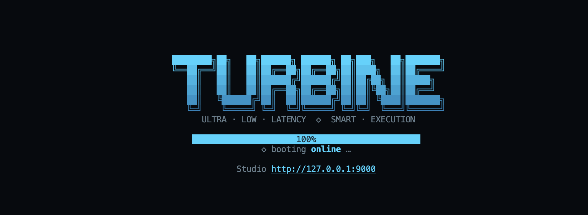

**[Complete Architectural Document →](https://docs.google.com/presentation/d/1WPVPPuMAiaqzYktap83oNc2iMOPpyrg0m-BdWr4AoX4/edit?usp=sharing)** (Google Slides)

[](https://www.rust-lang.org/)
[](https://tokio.rs/)
[](https://solana.com/)
[](https://jito.wtf/)
[](https://github.com/rpcpool/yellowstone-grpc)
[](LICENSE)

---

## What is TURBINE?

Turbine is an ultra-low latency smart transaction infrastructure for Solana that observes the network in real time, prices transaction tips using live write-lock accounts contention, submits through Jito Bundles, tracks transaction lifecycle across every commitment level, and autonomously retries failed transactions using an AI decision engine

---

## TURBINE Wins. Why?

### 1. Tech stack: built for speed

- **100% Rust** workspace: Predictable, optimized binaries | Single Tokio multi-thread runtim with explicit hot / warm / cold lanes.
- **Lock-free hot reads**: `ArcSwap` snapshots, sharded `DashMap`, and atomics. The submit path never takes a global mutex, always kept ultra-fast.
- **Provider-safe backpressure:** bounded `mpsc(8192)` — no unbounded RAM; account-filtered subs + dedicated Geyser reader + lightweight DPU keep the stream draining so the **provider never sees a stalled consumer**.

### 2. Write-lock Contention-aware Tip Pricing.

Every transaction on Solana locks the accounts it writes to.

Transactions competing for the same write-locks compete for inclusion, making write-lock contention a much stronger pricing signal than network-wide congestion.

TURBINE continuously observes transactions touching your monitored accounts through Yellowstone/Geyser, reconstructs each transaction's writable account set, and maintains a real-time contention score for every account. Tip prices are then derived from tip_floor and actual write-lock competition, closely matching how Solana's scheduler and the Jito auction prioritize transactions.

### 3. Exponential Moving Averages (EMA) To Smooth Market Noise.

Real-time tip updates and write-lock contention are inherently noisy. TURBINE uses time-decayed EMAs to smooth tip prices, contention scores, and market variance, allowing it to distinguish sustained congestion from short-lived spikes. The result is more stable bidding, better congestion classification, and consistently lower overpayment.

### 4. Deshredded Transactions. Earlier Signals, Faster Decisions (Optional).

By subscribing to deshredded transactions, TURBINE observes network activity before the blocks are assembled. Earlier visibility means earlier contention detection, earlier pricing updates, and faster transaction decisions when every millisecond matters.


## Quick Proof of Ultra-Low-Latency & Tip Intelligence.

Five **mainnet** bundles from live `transactions.jsonl` runs (`happy-path-single-tx`, attempt 0, finalized), ranked by **smallest tip paid**.

| Signature | Submitted (UTC) | Submit slot | Landed slot | Submit → Processed | Processed → Confirmed | Confirmed → Finalized | Tip (◎) | Tip Δ |
|-----------|-----------------|-------------|-------------|--------------------|-----------------------|----------------------|---------|-------|
| [`3VrK…9kpo`](https://solscan.io/tx/3VrKDx5d7JzrmMF3fCJRmhLJUYUMcfpA1yiXvBPdEh9D433PScNGxnEU7TvMbXaiNdBTwfj7FfbNZEumxzzR9kpo) | 2026-06-28 07:52:40 | 429,410,365 | 429,410,367 | **355 ms** | 294 ms | 13,979 ms | 0.000010000 | −17,377 |
| [`4dXU…79F2`](https://solscan.io/tx/4dXUu39qoxqP2fnBzczabswFv2HpkZVrJYVTUxS7nYVEBqyJittaZ5gt1gnjmTH2Wfo5AiGek3LXr5L9FDE79F2) | 2026-06-28 08:37:03 | 429,416,991 | 429,416,992 | **373 ms** | 199 ms | 12,529 ms | 0.000011674 | +1,061 |
| [`46CB…5AHC`](https://solscan.io/tx/46CBfMz3U9emUUVvB9NyeZvpsBSnShZTpzXuia5yV5eKbFsnN6kt3FgkzDwhesVU3SpVg3CQPC3Sfgn2EZBV5AHC) | 2026-06-28 11:05:37 | 429,439,175 | 429,439,177 | **315 ms** | 216 ms | 12,162 ms | 0.000012675 | +1,152 |
| [`29jS…zKST`](https://solscan.io/tx/29jSJFwbLFR7oejDNuSNJJRFZib6fpZSzBeZBCsKwDjS4Heserv6C6i4e6gwYLFgF6zYEH6Cs9DEcynYUmC8zKST) | 2026-06-28 10:24:42 | 429,433,061 | 429,433,063 | **279 ms** | 410 ms | 11,834 ms | 0.000013131 | +1,193 |
| [`3UWS…7GJz`](https://solscan.io/tx/3UWSfLfDyqKwTWxU4pSsgqgnn43DdQCUV8aHvAVUL1ZD8GL3oAWfxqBXQzs5HZNiiHDgacPwhzDWceyWhWCW7GJz) | 2026-06-28 08:36:32 | 429,416,917 | 429,416,919 | **345 ms** | 405 ms | 13,135 ms | 0.000018111 | +1,646 |

**Takeaway:** Sub-400 ms submit→processed on mainnet with **~0.00001–0.000018 SOL** tips — gated one slot before the Jito leader (`gate_dist = 1` on every row). 

Note: This is just a sneak-peak, a larger table showing more reports happy, failure, and AI retry paths will be seen in a later section.

---

## Architecture

.png)

**[View The Complete Architectural Document Breakdown Here →](https://docs.google.com/presentation/d/1WPVPPuMAiaqzYktap83oNc2iMOPpyrg0m-BdWr4AoX4/edit?usp=sharing)** (Google Slides)

### Stack Overview

We built 10 rust crates for TURBINE as follows:

| Crate | Role |
|-------|------|
| `turbine-ingest` | Geyser gRPC, Jito tip WS/REST, warm RPC blockhash |
| `turbine-process` | DPU — write-lock extract, EMA contention, tip smooth, lifecycle hooks |
| `turbine-state` | `HotState` — atomics, `DashMap`, `ArcSwap` |
| `turbine-execute` | Fee matrix, compiler, gate, Jito submit, schedule, coordinator |
| `turbine-ai` | Cold-path analyst, governor, normalization |
| `turbine-ipc` | UDS control plane (bincode frames) |
| `turbine-tui` / `turbine-web` | Lossy telemetry surfaces |
| `turbine-cli` | `turbine` binary — start, run, stop, status. example: turbine start, turbine stop |
| `turbine-core` | Config, types, EMA math, `TelemetryEvent` |

### Architecture Overview

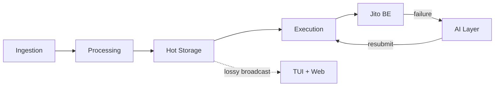

The mermaid diagram above shows the most basic architectural diagram for TURBINE. At a high level, TURBINE is split into 6 different layers (as seen above) working together and concurently. We will briefly go over each of them below:

Note: the explanations below is just a brief walkthrough of the layers. For complete teardown of the architecture, please visit the **[Google Slides →](https://docs.google.com/presentation/d/1WPVPPuMAiaqzYktap83oNc2iMOPpyrg0m-BdWr4AoX4/edit?usp=sharing)**

---

### 1 · Ingestion (`turbine-ingest`)

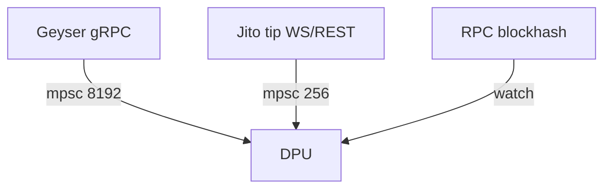

**Sources:** Yellowstone/Geyser (TLS gRPC), Jito `tip_stream` WebSocket + `tip_floor` REST, Solana JSON-RPC (`getLatestBlockhash`, boot-only tip accounts).

**Streams subscribed:**

| Stream | Filter | Purpose |
|--------|--------|---------|
| Slots | processed / confirmed / finalized | Chain head, EMA flush, lifecycle |
| Target txs | `account_include = watched_accounts` | Contention — only competing accounts |
| Self txs | `account_include = wallet.pubkey` | Own-bundle landed detection |

**Geyser consumption (provider-safe):** If our reader stops pulling, *SolInfra* feel it. We keep the stream moving:

- **`account_include = watched_accounts`**, not program-wide firehoses; subscribe only to what we process.
- **Dedicated reader** — decode + enqueue only; **`mpsc(8192)`** burst buffer.
- **Lightweight DPU** — inline parse, sharded `DashMap` writes; no RPC, disk, or LLM on the ingest path → queue drains before the reader blocks on `send`.
- **HTTP/2 adaptive window + ping echo** — healthy gRPC flow on the wire.

Tips → `mpsc(256)`. Blockhash → `watch` (latest only).

---

### 2 · Data Processing Unit (`turbine-process`)

Single **`tokio::select!`** consumer — one serial writer to hot state, no lock-ordering surprises.

#### Transaction stream handling

1. **Target filter** → `extract::writable_accounts` parses the Solana message header:
   - Writable signers: `keys[0 .. S−RS]`
   - Writable non-signers: `keys[S .. K−RU]`
   - Plus `meta.loaded_writable_addresses` from ALTs
2. **Only watched accounts** increment per-slot window counters.
3. On each **SlotProcessed**, `flush_slot` folds windows into EMAs for every watched account (including zero-hit decay).

**Why write-locks matter:** Write-locks are one of the most essential metrics for calculating contention over a competitive account. That is exactly what Solana serializes and what Jito searchers compete over.

#### EMA & z-score formulas

Time-decayed EMA (irregular event times):

$$ \text{decay} = e^{-\frac{\ln(2) \cdot \Delta t}{\mathit{half\_life}}} $$

$$ \alpha = 1 - \text{decay} $$


$$ \text{EMA}_t = \alpha \cdot x_t + \text{decay} \cdot \text{EMA}_{t-1} $$


Per watched account, each slot boundary:

```
z = (fast − slow) / stddev        where stddev = sqrt(variance_ema)
```

Congestion tier:

| Condition | Tier | Tip floor |
|-----------|------|-----------|
| z ≤ `quiet_z` | Quiet | P25 |
| `quiet_z` < z < `hot_z` | Moderate | P50 |
| z ≥ `hot_z` | Hot | P95 |

Tip percentiles get **five independent EMAs** (p25–p99) with `tip_ema_half_life_ms` — execution reads smoothed lamports, never raw WS spikes.

**Self tx filter** → signature match → lifecycle `Processed` + `submit_to_processed_ms`.

---

### 3 · Hot Storage (`turbine-state`)

| Data | Primitive | Why |
|------|-----------|-----|
| Slot, health, kill switch | `AtomicU64` / `AtomicBool` | Single-word hot reads |
| Slot signal for gate | `watch::Sender<u64>` | Event-driven gate — no polling |
| Tips, blockhash, leader, schedule | `ArcSwap` | Whole-snapshot `load()` — no locks |
| Contention + lifecycle | `DashMap` | Sharded per-key — concurrent ingest + read |
| AI audit | `Mutex<VecDeque>` | Cold path (~1 write per failure) |

---

### 4 · Execution Engine (`turbine-execute`)

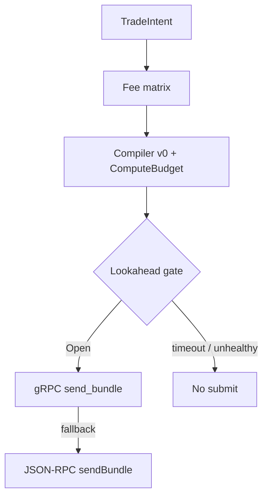

**Fee matrix:** `max_congestion(bundle_writes)` → percentile floor → smoothed lamports → flat bump + z-scaled bump → clamp `[min_tip, max_tip]`.

**Gate preconditions (all required):**

- `geyser_healthy`
- Blockhash age ≤ `blockhash_max_age_ms`
- `dist = next_jito_leader_slot − slot` in `[gate_min, gate_max]` (default: exactly **1**)
- Kill switch off

Gate awaits **`watch` slot notifications** — never busy-spins.

**Leader schedule:** Built once per epoch — kobe Jito validators ∪ config identities, intersected with `getLeaderSchedule`. Local `next_after(slot)` on every slot advance — **zero RPC on the gate path**.

**Submit:** gRPC primary (`SearcherService::send_bundle`), JSON-RPC fallback. Startup gRPC connect bounded to **5 s** so slow TLS never blocks daemon boot.

---

### 5 · AI Layer (`turbine-ai`) — cold path

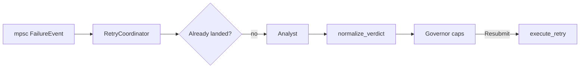

- Failures arrive on **`mpsc(256)`** — isolated from Geyser consumer.
- LLM classifies from real Jito poll text + enriched context (`tip_below_floor`, `blockhash_likely_stale`).
- **Governor** enforces max tip, max attempts, spend cap/min, kill switch.
- **Idempotency** aborts if Geyser already saw your signature on-chain.
- Coordinator rebuilds bundle; AI never signs directly.

---

### 6 · TUI & Web UI — off the hot path

| Surface | Data path | Blocks engine? |
|---------|-----------|----------------|
| **TUI** | `broadcast<TelemetryEvent>(2048)` @ 250 ms publish | No — render on `spawn_blocking` |
| **Web Studio** | Same bus + 400 ms `HotState` history snapshot over WebSocket | No — lossy; `Lagged` drops frames |
| **IPC** | UDS bincode → daemon → engine | No — separate `mpsc(64)` |

#### TURBINE Terminal UI

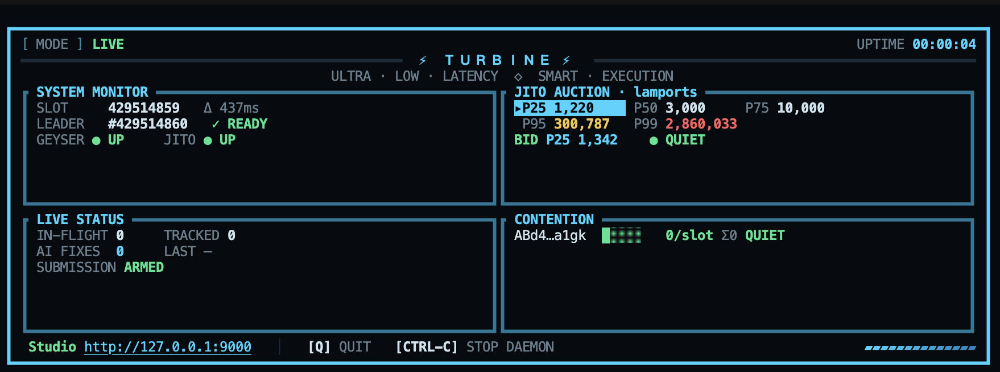

#### TURBINE Web Studio at http://127.0.0.1:9000

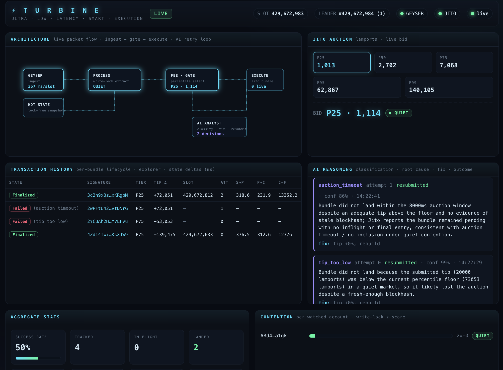

---

## Live Transactions Summary

Mainnet audit log excerpt — happy paths, AI-recovered failures, and idempotency catches. Lamports shown as SOL (÷ 10⁹). Latency columns in **ms**: S→P (submit→processed), P→C (processed→confirmed), C→F (confirmed→finalized).

| Label | Att | State | Signature | Slot | Tip (◎) | S→P | P→C | C→F | AI class | Retry fix |
|-------|-----|-------|-----------|------|---------|-----|-----|-----|----------|-----------|
| happy-path-single-tx | 0 | Finalized | [`29jS…zKST`](https://solscan.io/tx/29jSJFwbLFR7oejDNuSNJJRFZib6fpZSzBeZBCsKwDjS4Heserv6C6i4e6gwYLFgF6zYEH6Cs9DEcynYUmC8zKST) | 429,433,061 | 0.000013 | 279 | 410 | 11,834 | — | — |
| happy-path-single-tx | 0 | Finalized | [`46CB…5AHC`](https://solscan.io/tx/46CBfMz3U9emUUVvB9NyeZvpsBSnShZTpzXuia5yV5eKbFsnN6kt3FgkzDwhesVU3SpVg3CQPC3Sfgn2EZBV5AHC) | 429,439,175 | 0.000013 | 315 | 216 | 12,162 | — | — |
| happy-path-single-tx | 0 | Finalized | [`3VrK…9kpo`](https://solscan.io/tx/3VrKDx5d7JzrmMF3fCJRmhLJUYUMcfpA1yiXvBPdEh9D433PScNGxnEU7TvMbXaiNdBTwfj7FfbNZEumxzzR9kpo) | 429,410,365 | 0.000010 | 355 | 294 | 13,979 | — | — |
| fail-path-blockhash | 0 | Failed | [`41YS…HxyK`](https://solscan.io/tx/41YSb5W4kehfErCKqBr5G84Za45dyGQE1KdEeuo7R81DZj6HDwfq3AMYYZ4UEaQsbnqTB45921WeJQ43SM9iHxyK) | 429,433,159 | 0.000011 | — | — | — | blockhash_expired | fresh blockhash, rebuild |
| fail-path-blockhash | 1 | Finalized | [`4GiT…T9iU`](https://solscan.io/tx/4GiTnpZ1dkraZ9geig5uHKPxCaCe2NAZJNvwHXQGg6c97L9Asb2p45T6J98GkaLiQ4g47fNpfNZvJxRovG6aT9iU) | 429,433,189 | 0.000020 | 506 | 259 | 12,212 | — | — |
| fail-path-blockhash | 3 | Finalized | [`3ZMs…f5JK`](https://solscan.io/tx/3ZMskJVoBCf86R7euN183BXDPQ3v16R8qiKH46tUvpKZjjufSZzRsUq9ZQbyiGHzDR9uvZ6AndWEG6ayRJ9Pf5JK) | 429,439,054 | 0.000015 | 1,112 | 147 | 12,217 | — | — |
| fail-path-tip | 0 | Failed | [`62BT…4Yhw`](https://solscan.io/tx/62BTLTJuZfAUHLiTF5XbXErTSmVDA3CybbpNVKE9rfSMkfyCmB78BrN1at5J91jVXmU2BcVKxBKA86AyeAsG4Yhw) | 429,438,792 | 0.000000001 | — | — | — | tip_too_low | tip +30%, rebuild |
| fail-path-tip | 2 | Finalized | [`3vFZ…VAcu`](https://solscan.io/tx/3vFZu5H9fXwo2cokYZRMes1iF7DncccqVfqmKssxPq6LujzbRyzChvMAU2ukn37yVo6ENbvSPxeiqKfU2nFmVAcu) | 429,436,541 | 0.000020 | 270 | 128 | 12,690 | — | — |
| happy-path-single-tx | 0 | Failed* | [`2reU…bZoT`](https://solscan.io/tx/2reUaKGWqXTRJqS6D15hFwnKajG8SZv5E5GXGFZfq9JeuXdojnvMa96mqjKgudCSkJVnqLG2U4GGYQCVvPbgbZoT) | 429,366,967 | 0.000010 | 680 | — | — | landed | idempotency abort |
| happy-path-single-tx | 1 | Finalized | [`5UrH…5c5`](https://solscan.io/tx/5UrHb2BX2hRih5o6ViswX1FEZ4zwnjFEm8eRtBuacDDUJhjxE1Fm92Nv8NVF8CnuoYeKnqR9j157cZXHpwGyd5c5) | 429,415,374 | 0.000020 | 539 | 426 | 12,066 | auction_timeout | tip +20%, rebuild |
| happy-path-single-tx | 1 | Finalized | [`3sL3…JfFe`](https://solscan.io/tx/3sL3cD1NEt1rtCpnRhehHsUMAyzCymzbhFvYG3baQoo1XSG4kEDFYW9m954LmpWBXVKnHWr9viay9G4PxUN6JfFe) | 429,416,429 | 0.000020 | 268 | 511 | 11,935 | — | — |
| happy-path-single-tx | 0 | Finalized | [`3UWS…7GJz`](https://solscan.io/tx/3UWSfLfDyqKwTWxU4pSsgqgnn43DdQCUV8aHvAVUL1ZD8GL3oAWfxqBXQzs5HZNiiHDgacPwhzDWceyWhWCW7GJz) | 429,416,917 | 0.000018 | 345 | 405 | 13,135 | — | — |
| happy-path | 1 | Finalized | [`3xM3…ARkY`](https://solscan.io/tx/3xM3iyXmVmpAUHUbW1bCrVtYsz9NUkZWMnt1M5SCniHxksaEnEtM5tcr3qGqqvCAg1KSr8bB6ZdtePYr8SNRARkY) | 429,410,469 | 0.000200 | 655 | 224 | 12,523 | auction_timeout | tip bump + rebuild |
| fail-path-blockhash | 1 | Finalized | [`4WQk…fREy`](https://solscan.io/tx/4WQkmrsFke7AWrMSzzAeHW7qNwU3AkUfxjxZK7vTC5QPHfcfJVpVitB4RhGM2VR4BE2YNLgug3Wrs82VM82cfREy) | 429,436,271 | 0.000020 | 276 | 151 | 13,197 | — | — |
| happy-path-single-tx | 1 | Finalized | [`5HUp…mWTD`](https://solscan.io/tx/5HUpXRBqxr7QFCqWUd277YTQhGVaxyFeQCNcmLWkDKC7J17EHx3EwoyVFJWXdErg8u3R8jTSdip8PLnxgkmfmWTD) | 429,411,815 | 0.000200 | 270 | 332 | 12,346 | — | — |
| happy-path-single-tx | 0 | Failed | [`4ERL…7w5a`](https://solscan.io/tx/4ERLWkmPtdekXt2kqYngctbfTsJpj8g7kVCi8JqttywxtFtXPUhJR7iou6CHBNBVaotuVTuR5drYxw4A2ycJ7w5a) | 429,518,646 | 0.000005 | — | — | — | auction_timeout | tip +20%, resubmitted |
| happy-path-single-tx | 3 | Failed | [`617h…LQg8`](https://solscan.io/tx/617hki66UzqD5DR2j9AzppPewgWN9WoKcJoTaUu4XudzXZmq5h1JDRB7LP4arzGMQNWBNW63nMj2m62T7divLQg8) | 429,518,731 | 0.000007 | — | — | — | exhausted | retry budget hit |

\*Failed in lifecycle tracker because Jito JSON-RPC returned `Invalid` while Geyser had already confirmed the tx — AI correctly classified **landed** and aborted retry (no double-execute).

**Observations**

- **Submit → processed** consistently **270–400 ms** on first-attempt happy paths with **0.00001–0.00002 SOL** tips when `gate_dist = 1`.
- **AI blockhash recovery** (`fail-path-blockhash`) lands on attempt 1–3 after fresh warm blockhash — no tip bump on stale-hash class.
- **AI tip recovery** (`fail-path-tip`) escalates from 1 lamport → floor-aligned tip over attempts; attempt 2 finalized at 270 ms S→P.
- **Idempotency** prevented false retries when Jito polls were inconclusive but Geyser self-tx had already landed — a common mainnet pattern (`inflight=Invalid`, empty `Pending`).

---

## Statistical Analysis

Charts plotted from `transactions.jsonl` mainnet runs. The headline: **execution is fast (about 270–400 ms to processed), finality is dominated by the confirmed→finalized stage (about 12–14 s cluster)** — tip spend barely moves that tail.

### 1 · Latency components over time

Three lifecycle stages per transaction. Confirmed→Finalized (red) dominates total time; 5-point rolling MA smooths the trend.

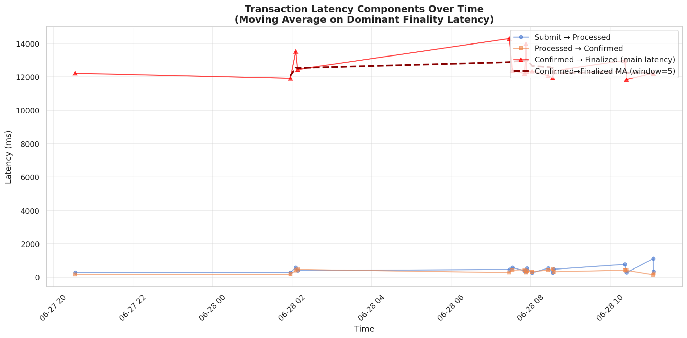

### 2 · Latency distributions

Histograms + KDE per stage and total observed latency. Early stages are tight; finality clusters at ~12–14 s.

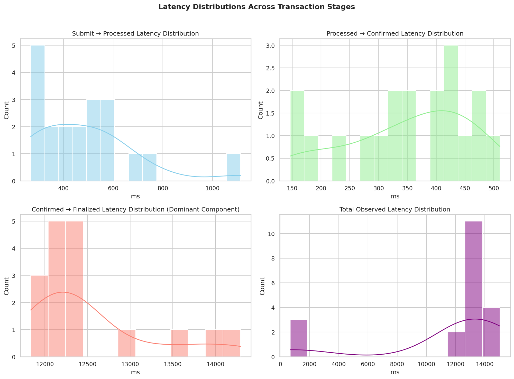

### 3 · Latency boxplots by category

Finality latency across outcome (Finalized vs Failed), attempt (0 vs retry), and scenario label. Retries and higher-tip paths show measurable shifts.

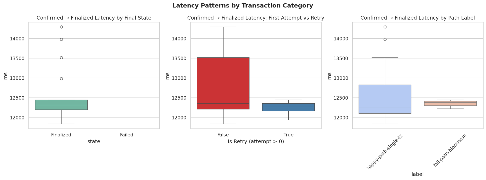

### 4 · Tip vs finality latency

Tip (lamports) vs Confirmed→Finalized, colored by percentile, sized by attempt — with linear regression and correlation. Useful for validating that modest tips don't buy faster finality.

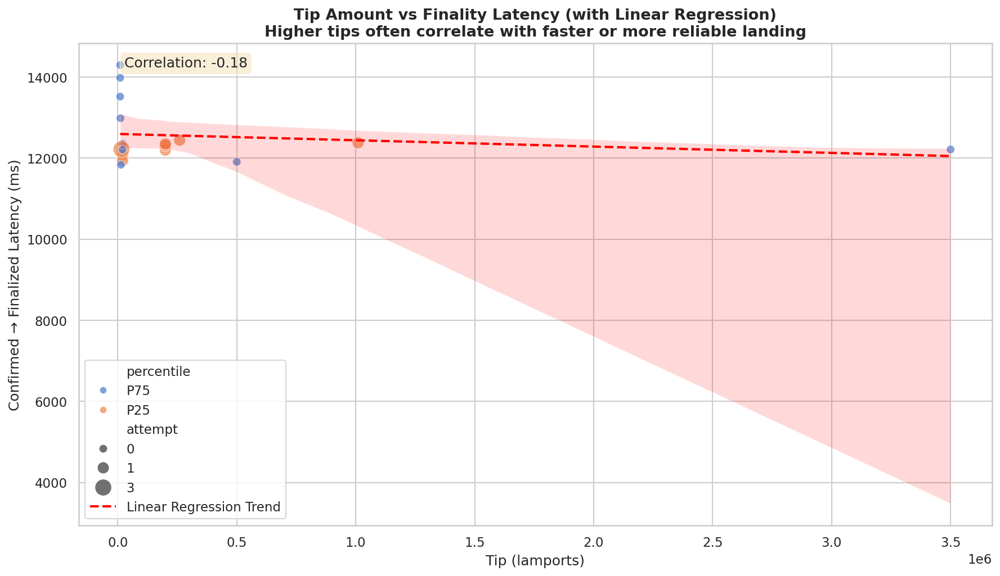

### 5 · Failure analysis

Left: failure reason breakdown (`AuctionTimeout` dominant in inconclusive-poll windows). Right: attempt × outcome heatmap — retries recover blockhash/tip failures; guardrail exhaustion stops the rest.

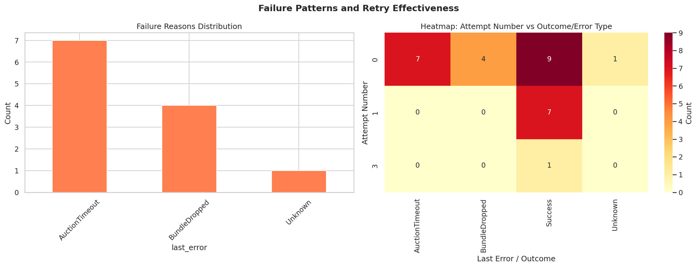

### 6 · Finality latency trend

Finality latency over transaction sequence — linear regression slope + rolling MA. Overall stable; no systematic drift across the test window.

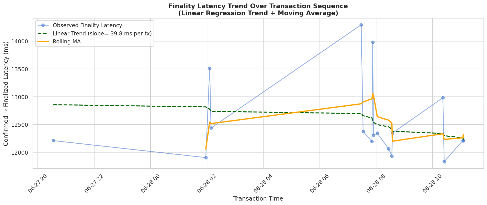

---

## Lessons from Building on Mainnet

1. **ComputeBudget is mandatory.** Bundles without a leading `SetComputeUnitLimit` instruction failed immediately unless we paid **5M–10M lamport** tips — Jito effectively treated them as unbounded-CU bundles. TURBINE prepends ComputeBudget as the **first instruction on every tx**.

2. **Jito `tip_floor` is historical, not real-time.** The REST/WS percentiles reflect landed tips from prior slots (often tens of slots behind). We apply a configurable **flat bump** (`tip_bump_pct`, default 10%) plus **z-scaled contention bump** on top of the smoothed floor — bidding the raw floor alone under-lands during active auctions.

3. **Custom Searcher gRPC client.** Public Jito SDKs did not match our latency and dependency constraints. We vendor protos under `turbine-execute/proto/` and generate the client with `tonic-build` — gRPC submit + `subscribe_bundle_results` without pinning a foreign `solana-sdk`.

4. **Filter Geyser by account, not program.** Program-wide subscriptions flooded `mpsc(8192)` and triggered provider backpressure disconnects. Watched-account filtering reduced inbound volume by orders of magnitude.

5. **Monotonic slot head.** Subscribing to processed + confirmed + finalized means older slot numbers arrive after the leading edge — `fetch_max` on the atomic head prevents gate distance corruption.

6. **Inconclusive Jito polls ≠ failure.** Early `Invalid` and empty `Pending` arrays are normal; routing them to AI caused false `BundleDropped` labels until we added `jito_polls.jsonl` auditing and idempotency checks against Geyser self-tx.

---

## Solana Transaction Layer — Q&A

### Q1 · What does the delta between `processed_at` and `confirmed_at` tell you about network health at the time of submission?

It measures **validator voting latency** after your transaction is executed and observed at processed commitment. In our mainnet runs, processed→confirmed was typically **150–500 ms** when the cluster was healthy. Spikes toward **800 ms+** (see early `fail-path` rows) correlate with periods where the same bundles also saw inconclusive Jito inflight polls — the cluster was still advancing slots, but **consensus propagation was slower than normal**, so confirmation lag was a useful real-time health signal independent of our submit latency.

### Q2 · Why should you never use `finalized` commitment when fetching a blockhash for a time-sensitive transaction?

A **finalized** blockhash is tied to a block that is already **~32+ slots behind the chain head**. By the time you fetch, sign, and submit through Jito's auction window, that hash is often near or past `last_valid_block_height` — validators reject the tx with `BlockhashNotFound`. TURBINE polls `getLatestBlockhash` at **confirmed** commitment every 2 s into a warm cache and refuses the gate when `blockhash_age_ms > blockhash_max_age_ms` (45 s default). Our `fail-path-blockhash` scenario deliberately forces a stale hash on attempt 0; AI recovery always rebuilds against the **fresh warm cache** on retry.

### Q3 · What happens to your bundle if the Jito leader skips their slot?

The bundle **does not land in that slot** — there is no Jito-augmented block for a skipped leader slot. TURBINE's gate targets `next_jito_leader_slot` with `gate_dist = 1`; if that leader skips, our bundle misses that window and we wait for the **next Jito leader** in the epoch-cached schedule (local `next_after(current_slot)` updates every slot via Geyser). We observed this as `AuctionTimeout` / empty Jito inflight entries while Geyser remained healthy — not a tip-floor issue, but a **missed leader window** requiring resubmit on the next Jito slot.

---

## Project Structure

```
turbine/
├── Cargo.toml                 # workspace, release profile (LTO), shared deps
├── turbine.toml               # runtime config (example — copy & edit)
├── transactions.jsonl         # mainnet audit log (runtime output)
├── jito_polls.jsonl           # Jito JSON-RPC poll audit (runtime output)
├── assets/                    # README images + architecture diagram
├── ARCHITECTURE.md            # layered Mermaid diagrams
├── SYSTEM_GUIDE.md            # end-to-end prose + tech decisions
└── crates/
    ├── turbine-core/          # config, EMA, types, telemetry events
    ├── turbine-ingest/        # Geyser, Jito tips, blockhash refresher
    ├── turbine-process/       # DPU — extract, smooth, lifecycle hooks
    ├── turbine-state/         # HotState façade
    ├── turbine-execute/       # fee, compile, gate, submit, schedule, coordinator
    │   └── proto/             # vendored Jito searcher protos
    ├── turbine-ai/            # analyst, governor, normalize
    ├── turbine-ipc/           # UDS server + client
    ├── turbine-tui/           # ratatui dashboard
    ├── turbine-web/           # axum web studio (embedded HTML)
    └── turbine-cli/           # `turbine` binary
```

---

## How to Test

### 1 · Clone & build

```bash
git clone https://github.com/tsmboa0/TURBINE.git
cd turbine
cargo build --release
cargo install --path crates/turbine-cli
```

### 2 · Configure `turbine.toml`

Copy the example and set:

| Setting | Purpose |
|---------|---------|
| `[geyser].endpoint` + `x_token` | Yellowstone provider (or `TURBINE_GEYSER_ENDPOINT`) |
| `[rpc].http_url` | Dedicated RPC — public endpoints rate-limit blockhash refresh |
| `[wallet].keypair_path` + `pubkey` | Payer + self-tx Geyser filter (`TURBINE_WALLET_KEYPAIR`) |
| `[targets].watched_accounts` | Accounts your strategy write-locks (contention set) |
| `[jito].*` | Block engine URL, tip URLs, kobe validators URL |
| `[execution].dry_run` | `true` = pipeline without wire I/O; `false` = live mainnet |
| `[ai].enabled` + `TURBINE_AI_API_KEY` | Required for autonomous fail-path retry |
| `[server].web_bind` | Web studio (default `127.0.0.1:9000`) |

Fund the wallet with **~0.02–0.05 SOL** for a full autopilot run. For testing, consider lowering `strategy.max_tip_lamports` (e.g. `100000` = 0.0001 SOL).

### 3 · Start the daemon

```bash
export TURBINE_AI_API_KEY="sk-..."
export TURBINE_GEYSER_X_TOKEN="your-token"   # if not in turbine.toml

turbine start --config turbine.toml

# TUI on interactive terminals; logs → $TMPDIR/turbine.log
# Web studio → http://127.0.0.1:9000
```

Use `--no-tui` for headless logging.

### 4 · Run scenarios (second terminal)

```bash
turbine run happy-path-single-tx --config turbine.toml   # 1-tx bundle, should land
turbine run fail-path-tip --config turbine.toml          # low tip → AI bump → retry
turbine run fail-path-blockhash --config turbine.toml    # stale hash → AI refresh → retry
turbine run autopilot --config turbine.toml              # 10 random actions, 2–5 s apart
turbine status --config turbine.toml
turbine stop --config turbine.toml
```

### 5 · Verify results

- **TUI** — slot, leader countdown, tip spread, contention gauges, in-flight count
- **Web Studio** — transaction history, lifecycle deltas, AI reasoning log
- **`transactions.jsonl`** — per-bundle audit with tip floor, delta, gate context
- **`jito_polls.jsonl`** — every Jito status poll with interpretation

### 6 · Unit tests

```bash
cargo test
cargo clippy --workspace -- -D warnings
```

---

## License

MIT — see [LICENSE](LICENSE) (workspace `license = "MIT"` in `Cargo.toml`).

---

## Further Reading

- [Architectural Document (Google Slides)](https://docs.google.com/presentation/d/1WPVPPuMAiaqzYktap83oNc2iMOPpyrg0m-BdWr4AoX4/edit?usp=sharing)
- [ARCHITECTURE.md](ARCHITECTURE.md) — full Mermaid diagram set
- [SYSTEM_GUIDE.md](SYSTEM_GUIDE.md) — detailed end-to-end system guide
- [IMPLEMENTATION_PLAN.md](../IMPLEMENTATION_PLAN.md) — original phased design plan